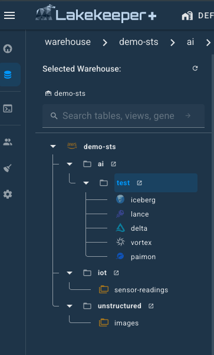
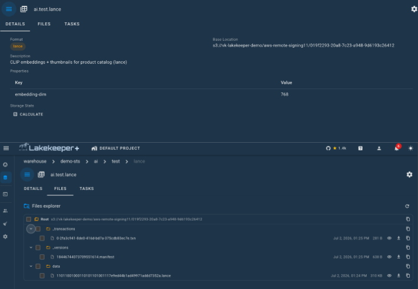
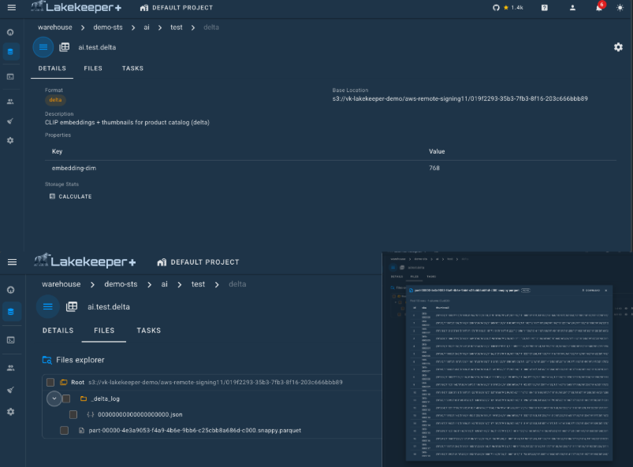
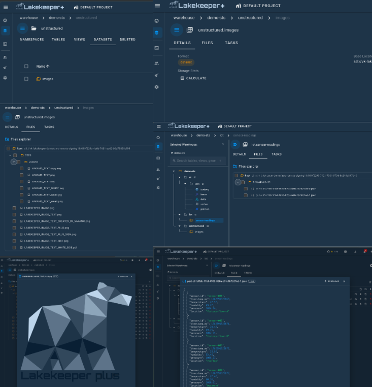

# Generic Tables

Lakekeeper's **Generic Table API** catalogs non-Iceberg tables — Lance, CSV, Parquet, or any other format — alongside Iceberg tables in the same Warehouse. Each generic table sits in a Namespace, has a name, a `format` string, an optional base `location`, `schema`, `statistics`, `properties`, and a free-form `doc` field. Engines handle writes against the underlying format; Lakekeeper handles **identity, governance, access control, and lifecycle**.

{ width="50%" }

Unlike Iceberg tables, Lakekeeper does not commit format-specific metadata for generic tables — readers and writers go directly to the storage location after obtaining catalog metadata and credentials. This makes the API format-agnostic: any future or experimental format works without changes to the catalog.

## When to use generic tables

- **Raw landing zones** — register CSV, JSON, or Parquet drops so they show up in the same catalog and inherit the same permissions as downstream Iceberg tables.
- **Lance for multimodal AI** — store text, image embeddings, raw bytes, and scalar features in one table, then run vector + SQL queries via LanceDB, DuckDB, or Polars. See the example below.
- **Experimental formats** — prototype new file/table formats behind the same `/credentials`, soft-delete, and authorization plumbing as production Iceberg tables.

## Capabilities

Generic tables are first-class citizens. Most of Lakekeeper's table-side machinery applies:

| Feature | Generic tables | Notes |
|---------|:--------------:|-------|
| Credentials vending (S3, GCS, Azure) | :white_check_mark: | `GET /lakekeeper/v1/{prefix}/namespaces/{ns}/generic-tables/{t}/credentials` |
| [Soft-deletion](./concepts.md#soft-deletion) + undrop | :white_check_mark: | Respects per-warehouse soft-delete settings |
| [Protection](./concepts.md#protection) flag | :white_check_mark: | `protected: bool` on load response; toggle via `GET/POST /management/v1/warehouse/{wh}/generic-table/{id}/protection`. Drops require `force=true` when set. |
| Rename | :white_check_mark: | `POST /lakekeeper/v1/{prefix}/generic-tables/rename` |
| Listing + pagination | :white_check_mark: | Same cursor scheme as Iceberg tables |
| Per-action permissions | :white_check_mark: | 16 distinct actions (`drop`, `undrop`, `read_data`, `write_data`, `get_metadata`, `rename`, `change_ownership`, grant-* relations, ...) |
| [Case-insensitive identifiers](./concepts.md#identifier-case-sensitivity) | :white_check_mark: | Cross-engine name resolution applies |
| Name uniqueness across types | :white_check_mark: | A generic table cannot collide with an Iceberg table or view in the same Namespace |
| Stored schema / statistics fields | :white_check_mark: | Free-form JSON; informational only |
| Format-agnostic | :white_check_mark: | `format` is an opaque string |
| Commit coordination | :x: | The catalog does not arbitrate writes — engines write directly |
| Schema enforcement | :x: | Schema is stored, not validated against data files |

## Working with generic tables

The flow is the same for every format: create the table, load it with *vended* credentials, then read or write directly with the format's own library. Lakekeeper only brokers metadata and short-lived storage credentials — never the data itself — so the same credentials path works for any format and only the reader library changes.

You don't need to hand-roll these HTTP calls:

- **Python** — the [Python client (`pylakekeeper`)](generic-tables-pylakekeeper.md) wraps create/load/list/drop and maps vended credentials into the keys Lance, `boto3`, and `fsspec` expect. See its [Lance example](generic-tables-pylakekeeper.md#example-lance-table).
- **PySpark** — [Apache Spark](generic-tables-spark.md) reads and writes generic tables through the same vending flow.
- **Java / Flink** — [Apache Flink](generic-tables-flink.md) shows the same vending flow.

For a runnable end-to-end example (warehouse setup, STS credentials, create/load/drop, undrop, listing), see [`tests/integration-tests/lance/test_lance.py`](https://github.com/lakekeeper/lakekeeper/blob/main/tests/integration-tests/lance/test_lance.py).

## In the Console

The Lakekeeper Console lists generic tables alongside Iceberg tables and views inside each Namespace, tagged with their `format` so you can tell them apart at a glance. Selecting one opens a detail view with its location, schema, statistics, properties, and the same actions (rename, protect, drop/undrop, permissions) available for Iceberg tables.

Because the `format` field is an opaque string, any format shows up as a first-class entry — below are a few common ones.

### Lance

Multimodal / vector tables written with Lance. The detail view surfaces the stored schema (embeddings, scalar features, raw bytes) and the storage location engines read from.

{ width="100%" }

### Delta

Delta Lake tables cataloged as generic tables — governed and permissioned in Lakekeeper while engines read/write the Delta log directly at the table location.

{ width="100%" }

### Dataset

A raw dataset (CSV / JSON / Parquet drop) registered so it appears in the catalog and inherits the surrounding Namespace's permissions.

{ width="100%" }

## Authorization model

Generic tables have an OpenFGA object type (`lakekeeper_generic_table`) parallel to `lakekeeper_table` and `lakekeeper_view`. Permissions inherit from the parent Namespace and Warehouse, and can be granted to users or roles via the standard `/management/v1/permissions/generic-table/{id}` endpoints. See [Authorization](./authorization.md).

Because grants are per-action, you can — for example — give an ML platform service `read_data` and `get_metadata` on every generic table in a namespace without granting `drop` or `change_ownership`.

## Limits

- The catalog does not coordinate concurrent writes. If your format requires commit coordination, the engine or the format library is responsible.
- Schema and statistics fields are informational. Engines that need an authoritative schema should read it from the underlying files.
- Generic tables and Iceberg tables share the namespace's identifier space — a name conflict across types is rejected at create time.
