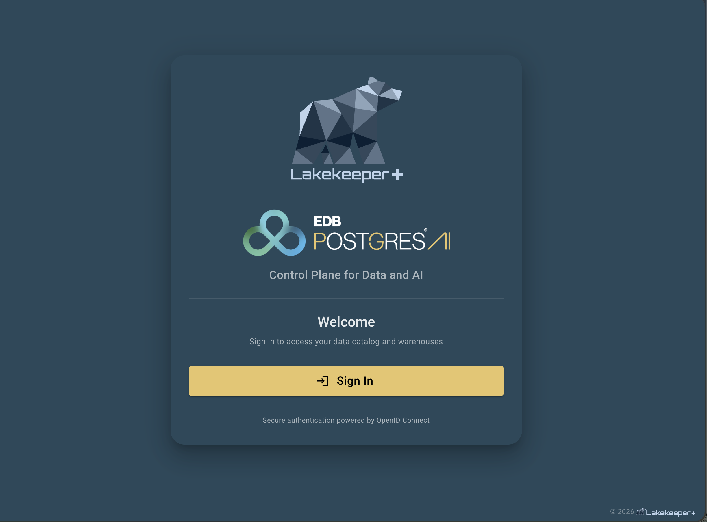
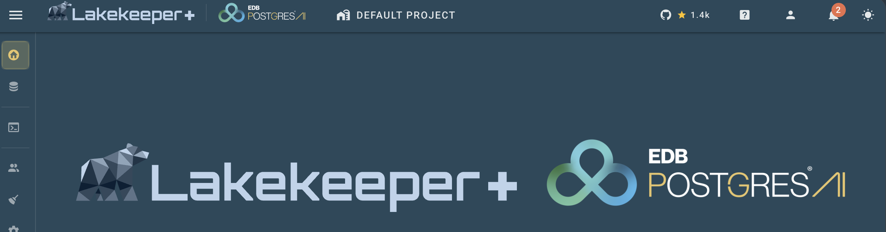

# UI Branding <span class="lkp"></span> {#ui-branding}

Lakekeeper Plus lets you **customize the built-in UI** for a deployment: replace the color scheme and place a partner logo next to the Lakekeeper+ logo — with **no rebuild**. Branding is applied at container start from a single environment variable, so the same image can be re-skinned per customer or per environment.

Branding is a **Lakekeeper Plus** feature. The open-source console ships the standard Lakekeeper theme and cannot be re-skinned.



## How it works

You describe the branding as a small JSON document, **base64-encode** it, and pass it to Lakekeeper Plus in the `LAKEKEEPER__UI__BRANDING` environment variable. At serve time Lakekeeper substitutes the value into the UI, which decodes it **synchronously before the app mounts** — so there is no flash of the default theme and no extra network request.

```text
branding.json  --base64-->  LAKEKEEPER__UI__BRANDING  --serve-->  themed UI
```

Everything in the document is **optional**. Omit a color and the Lakekeeper default is kept; omit the logos and only the colors change.

## The branding document

```json title="branding.json"
{
  "themes": {
    "light": {
      "primary": "#EE0000",
      "primary-darken-1": "#BE0000",
      "on-primary": "#FFFFFF",
      "secondary": "#212121",
      "background": "#FFFFFF",
      "surface": "#FFFFFF",
      "error": "#DC3545",
      "warning": "#FFC107",
      "success": "#198754",
      "info": "#1565C0"
    },
    "dark": {
      "primary": "#EE0000",
      "on-primary": "#FFFFFF",
      "secondary": "#D9D9D9",
      "background": "#212121",
      "surface": "#212121",
      "error": "#FF4D5E",
      "info": "#4AA3DF"
    }
  },
  "logoLight": "data:image/svg+xml;base64,PHN2Zy4uLg==",
  "logoDark":  "data:image/svg+xml;base64,PHN2Zy4uLg=="
}
```

`themes.light` and `themes.dark` are applied on top of the corresponding Lakekeeper base theme, so you only list the tokens you want to override.

### Color tokens

| Token | Controls |
|-------|----------|
| `primary` | The brand color: primary buttons and call-to-action controls (for example **Add Warehouse**), active states, links, highlights. |
| `primary-darken-1` | Hover/pressed shade of `primary`. |
| `on-primary` | Text/icon color drawn **on** a `primary` surface — set it to whatever stays readable on your primary (usually `#FFFFFF` or `#000000`). |
| `secondary` | Secondary buttons and accents. |
| `secondary-darken-1` | Hover/pressed shade of `secondary`. |
| `background` | Page background. |
| `surface` | Cards, dialogs, navigation surfaces. |
| `surface-bright`, `surface-light`, `surface-variant` | Elevated / alternate surface shades. |
| `on-surface`, `on-surface-variant` | Text/icon color on surfaces. |
| `error`, `warning`, `success`, `info` | Semantic status colors (alerts, chips, icons). |

!!! tip "`info` is not always blue"
    Several informational controls use the `info` token. If your palette has no blue, set `info` to a color that fits your brand so those controls don't stand out — for example a red brand can set `info` to its red instead of the default blue.

### Logos

Two logos are shown next to the Lakekeeper+ mark (AppBar, login page, and home page). The naming follows the theme they appear **on**:

| Field | Shown on | Use |
|-------|----------|-----|
| `logoDark` | the **light** theme (white bar) | your **dark-colored** logo |
| `logoLight` | the **dark** theme (dark bar) | your **light / white** logo |

Use **SVG** logos: they stay crisp at every size the UI renders them (AppBar, login, home), are small once base64-encoded, and never blur. Provide each logo as a **`data:` URI** (recommended — self-contained, works in air-gapped deployments) or an `https://` URL. Raster formats (PNG, etc.) are technically accepted via their own MIME type, but are not recommended.

For a tight fit next to the Lakekeeper+ logo, use a **horizontal** logo (wordmark) with little surrounding whitespace in its `viewBox`.

## Building the base64 string

1. **Write `branding.json`** with your colors, following the shape above.

2. **Inline each SVG logo as a `data:` URI** and paste it into `logoLight` / `logoDark`:

    ```bash
    printf 'data:image/svg+xml;base64,%s' "$(base64 -w0 logo.svg)"
    ```

    On macOS use `base64 -i logo.svg` (no `-w0`).

3. **Base64-encode the whole document** — this is the value for the env var:

    === "Linux"
        ```bash
        base64 -w0 branding.json
        ```
    === "macOS"
        ```bash
        base64 -i branding.json
        ```

4. **Verify** it decodes back to your JSON:

    ```bash
    echo "<the base64 string>" | base64 -d | jq .
    ```

## Applying the branding

Set the resulting string on the Lakekeeper Plus server:

```bash
LAKEKEEPER__UI__BRANDING="eyJ0aGVtZXMiOnsibGlnaHQiOns..."
```

=== "Docker Compose"
    ```yaml
    services:
      lakekeeper:
        image: quay.io/lakekeeper/lakekeeper-plus:latest
        environment:
          LAKEKEEPER__UI__BRANDING: "eyJ0aGVtZXMiOnsibGlnaHQiOns..."
    ```

=== "Kubernetes"
    ```yaml
    env:
      - name: LAKEKEEPER__UI__BRANDING
        valueFrom:
          secretKeyRef:
            name: lakekeeper-branding
            key: branding
    ```

The string can be long (logos are embedded), so storing it in a `Secret` / `ConfigMap` and referencing it — as above — is usually cleaner than inlining it.

Restart the server and reload the UI to see the new theme.



## Local development

When you run the UI with the Vite dev server (instead of the packaged binary), set the same base64 value in `VITE_UI_BRANDING` in your `.env` instead of `LAKEKEEPER__UI__BRANDING`. The dev server inlines env values **at startup**, so restart the dev server after changing it — a browser refresh alone won't pick it up.

## See also

- [Configuration -> UI](./configuration.md#ui) — all `LAKEKEEPER__UI__*` variables.
- [Logos](/about/logos/) — the official Lakekeeper marks.
